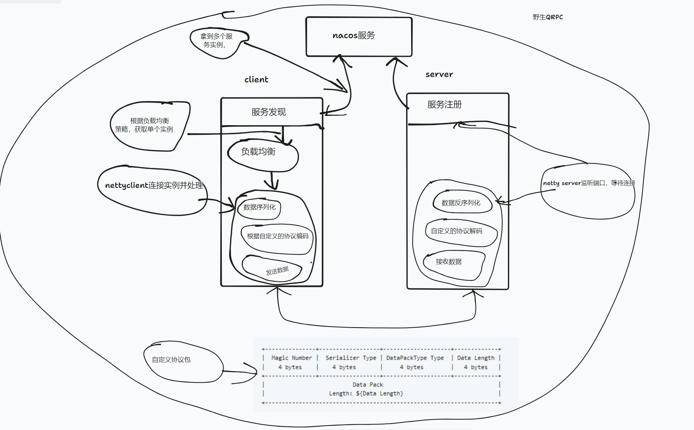

# qRPC

> 使用netty和nacos实现一个有注册与发现，负载均衡的RPC

### feature
- 1.nacos注册与发现
- 2.loadBalance负载均衡

### 协议设计
- Magic Number: 首位表示数据序列魔法常量 00xCAFEBABE
- Serializer Type: 第二位表示数据格式化方法 ,目前只支持1:json
- DataPackType Type: 1:表示request , 2:表示response
- Data Length: 数据包长度
- Data Pack : 数据包

```
+---------------+------------------+--------------------+-------------+
|  Magic Number |  Serializer Type | DataPackType Type  | Data Length |
|    4 bytes    |    4 bytes       |     4 bytes        |   4 bytes   |
+---------------+------------------+--------------------+-------------+
|                          Data Pack                                  |
|                   Length: ${Data Length}                            |
+---------------------------------------------------------------------+
```

###使用
- 1.首先启动nacos-server，自己去下载使用
- 2.启动NacosServer，在启动NacosClient，见test中的测试案例

### 实现原理
